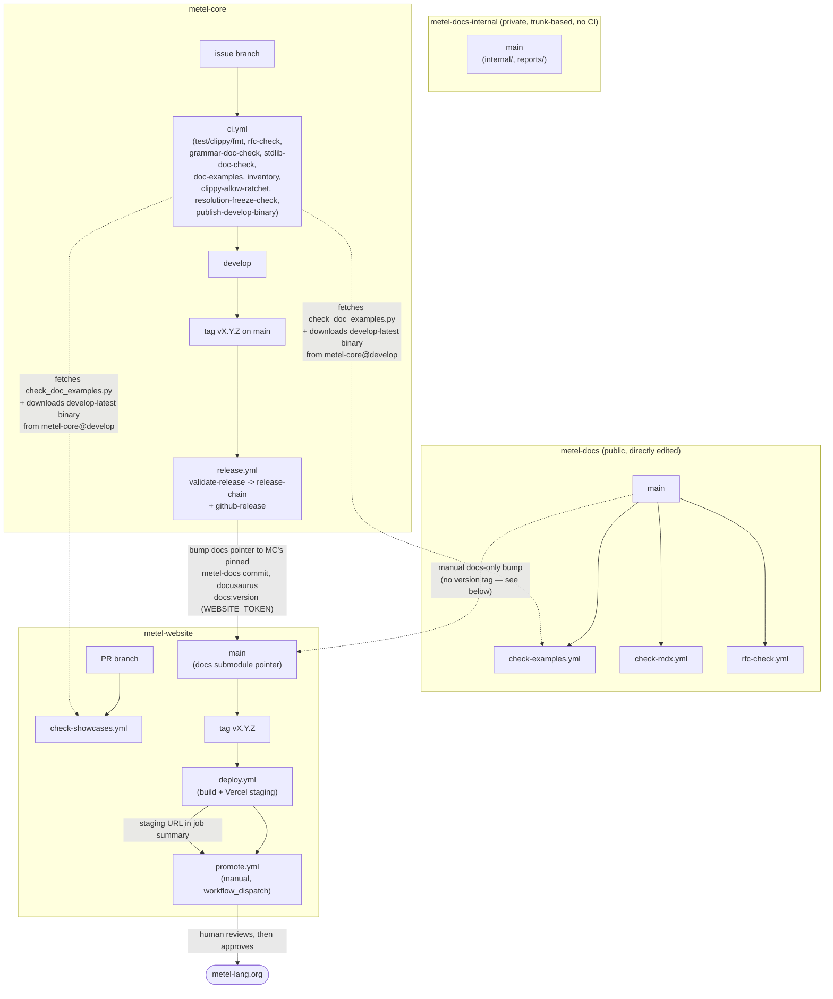

# Scripts and CI Processes

An inventory of every script and CI workflow across the four repositories this
project spans — `metel-core` (this repo), `metel-docs-internal`, `metel-docs`, and
`metel-website`. Nothing else currently lists all of this in one place (metel-core#687):
`RELEASING.md` covers the release chain specifically, `AGENTS.md` covers the per-PR/
release gates, but neither says what runs on an ordinary PR, what the RFC tooling
does, or which repo owns which secret, as a single system.

**Updated 2026-08-23 for ADR-0051**, which retired the one-way sync from
`metel-docs-internal`'s (private) `public/` tree into `metel-docs` (public). `metel-docs`
is now the directly-edited source for RFCs, the spec, and the rest of the exported
surface, including the tooling that operates on it (`rfc.py` and its three CI
workflows, all moved there). **Amended 2026-08-23: `architecture/` also moved to
`metel-docs`** (first the ADRs, then `architecture.md` itself — neither was private
content). `metel-docs-internal` keeps only `internal/` and `reports/` — genuinely
private content with no CI of its own anymore.

This doesn't replace those documents or duplicate their reasoning — it's the index of
*what exists*, so "what would break if I changed X" is a read, not a grep across three
repos.

## Keeping this current

Any pull request that adds, removes, or changes a workflow, a `tools/` script, or a
`.claude/commands/` slash command — in any of the three repos — updates this document
in the same pull request. This is the same discipline `AGENTS.md` already asks for the
changelog: reflected when the change lands, not reconstructed from history later.

`tools/check_inventory.sh` enforces the slice of this actually reachable from
metel-core's own CI: every workflow, `tools/` script, and slash command *in this repo*
must be named somewhere in this file, checked by the `inventory` job in `ci.yml` on
every PR. It cannot see `metel-docs`'s or `metel-website`'s own workflow
directories — there's no cheap way for one repo's CI to watch another's file
list on every push — so those two repos' slices rely on review catching a
new/changed workflow with no matching update here, the same way review already has to
catch a missing changelog entry that `tools/changelog-status.sh` can't see if the
underlying commit hasn't landed yet.

## The whole pipeline

**Updated for ADR-0051**: `metel-docs-internal` no longer has any CI (its own three
workflows moved to `metel-docs`, which is now directly edited and publicly readable —
no token needed to check it out). `metel-core`'s `release.yml` no longer writes to
`metel-docs` at all; it only reads `metel-core`'s own pinned `docs` submodule commit
when bumping `metel-website`'s pointer.



Solid arrows are automated triggers or writes. Dashed arrows are either a runtime
fetch (the checker script) or the one manual path (below) that has no workflow at
all.

## metel-core

| Path | Trigger | Reads | Writes | Secret(s) |
|---|---|---|---|---|
| `.github/workflows/ci.yml` — `ci` job | push/PR to `develop`/`main` | this repo | — | — |
| `.github/workflows/ci.yml` — `rfc-check` job | push/PR to `develop`/`main` | `docs` submodule (metel-docs, public), incl. `rfcs/COVERAGE-BASELINE.json`, this repo's `metel-interpreter/tests` | — | — |
| `.github/workflows/ci.yml` — `grammar-doc-check` job | push/PR to `develop`/`main` | `metel-frontend/src/grammar.pest`, `metel-frontend/src/grammar-doc.toml`, `docs` submodule's `reference/spec/grammar.md` | — | — |
| `.github/workflows/ci.yml` — `stdlib-doc-check` job | push/PR to `develop`/`main` | `metel-frontend/stdlib/*.mtl`, `docs` submodule's `reference/spec/runtime.md` | — | — |
| `.github/workflows/ci.yml` — `doc-examples` job | push/PR to `develop`/`main` | `README.md`, `docs` submodule | — | — |
| `.github/workflows/ci.yml` — `publish-develop-binary` job | push to `develop` only (not PRs) | this repo, at the pushed commit | this repo's GitHub Releases — rolling pre-release `develop-latest`, deleted and recreated each run (metel-core#696) | built-in `GITHUB_TOKEN` (`contents: write`, this repo only) |
| `.github/workflows/ci.yml` — `inventory` job | push/PR to `develop`/`main` | this repo's own workflows/tools/commands | — | — |
| `.github/workflows/ci.yml` — `clippy-allow-ratchet` job | push/PR to `develop`/`main` | `metel-frontend/src`, `metel-interpreter/src`, `tools/clippy-allow-baseline.json` | — | — |
| `.github/workflows/ci.yml` — `resolution-freeze-check` job | push/PR to `develop`/`main` | `metel-frontend/src/identity.rs`, `metel-frontend/src/typed_ast/mod.rs`, `metel-frontend/src/place.rs`, `metel-frontend/src/query.rs` | — | — |
| `.github/workflows/release.yml` — `validate-release` | tag `vX.Y.Z` pushed | `docs` submodule | — | — |
| `.github/workflows/release.yml` — `release-chain` | after `validate-release` | `docs` submodule (reads this repo's own pinned commit, does not write to `metel-docs` — ADR-0051 removed the sync) | `metel-website` main + tag | `WEBSITE_TOKEN` |
| `.github/workflows/release.yml` — `github-release` | after `validate-release` | `docs` submodule | this repo's GitHub Releases | built-in `GITHUB_TOKEN` |
| `tools/check_doc_examples.py` | invoked by `doc-examples`, and fetched at runtime by both other repos' checkers | any path of `.md`/`.mdx`/`.mtl` files passed on the CLI | stdout only | — |
| `tools/changelog-status.sh` | manual (`/ship-issue`, `/cut-release`) | `docs/release-notes/changelog.md`, git log | stdout only | — |
| `tools/check_inventory.sh` | invoked by `ci.yml`'s `inventory` job | this file, this repo's own workflows/tools/commands | stdout only | — |
| `tools/clippy_allow_ratchet.py` | invoked by `ci.yml`'s `clippy-allow-ratchet` job (`--check`); manual `--list` / `--write-baseline` | `metel-frontend/src`, `metel-interpreter/src` (scans `#[allow(clippy::...)]`), `tools/clippy-allow-baseline.json` | `tools/clippy-allow-baseline.json` (`--write-baseline` only); stdout otherwise | — |
| `tools/check_no_semantic_name_lookup.py` (metel-core#1054) | invoked by `ci.yml`'s `resolution-freeze-check` job (`--check`); manual (no args) to list findings | the frozen-IR / `ResolutionMap` files listed in its own `SCAN_FILES` (scans for a `String`/`Span`-keyed `HashMap`/`BTreeMap` field without a `// resolution-freeze-allow: <reason>` comment) | stdout only | — |
| `metel-frontend/src/bin/gen_grammar.rs` (metel-core#720) | invoked by `ci.yml`'s `grammar-doc-check` job (`--check`); manual `cargo run --bin gen_grammar` to regenerate | `metel-frontend/src/grammar.pest` (via `pest_meta`, the same crate `pest_derive` uses to parse `.pest` files -- no hand-written grammar parser), `metel-frontend/src/grammar-doc.toml` (display name + doc section per rule) | `docs` submodule's `reference/spec/grammar.md` (not `--check`) | — |
| `metel-frontend/src/bin/check_stdlib_docs.rs` (metel-core#718) | invoked by `ci.yml`'s `stdlib-doc-check` job; always read-only, nothing to regenerate | `metel-frontend/stdlib/{core,env,fs,process}.mtl` (via `metel_frontend::parser`, the interpreter's own frontend -- no separate Metel parser), `docs` submodule's `reference/spec/runtime.md` | stdout only | — |
| `.claude/commands/start-issue.md` | manual slash command | issue body, `develop` | new issue branch | — |
| `.claude/commands/ship-issue.md` | manual slash command | issue branch | PR to `develop`, fast-forward merge | — |
| `.claude/commands/cut-release.md` | manual slash command | `develop` | tag on `main`, triggers `release.yml` | — |
| `.claude/commands/gap-analysis.md` | manual slash command | milestone's open issues | edited/created issues | — |
| `.claude/commands/milestone-integration-test.md` | manual slash command (once per milestone, after `/gap-analysis`, before `/cut-release`) | milestone's `4-implemented` RFCs + changelog in-progress section, fixture corpus | new cross-feature fixtures, `docs/release-notes/integration/<version>.md`, issues for findings | — |
| `.claude/commands/review-typechecker.md` | manual slash command | a typechecker/inference diff | review report | — |
| `.claude/commands/new-rfc.md` | manual slash command | `docs/rfcs/` | new draft RFC | — |
| `RELEASING.md` | — (process doc) | — | — | — |
| `AGENTS.md` | — (process doc) | — | — | — |

**No secret needed for `docs` submodule reads anymore** — `metel-docs` is public
(ADR-0051), so `actions/checkout`'s `submodules: true` works unauthenticated. Before
ADR-0051 every row above that touched the `docs` submodule needed `DOCS_REPO_TOKEN`
(a read-only credential scoped to the then-private `metel-docs-internal`); that token
and the SSH-to-HTTPS rewrite step it required are both gone.

## metel-docs-internal

**No CI of its own as of ADR-0051** (2026-08-23) — its three workflows (below, under
`metel-docs`) checked `public/`, which moved out. What's left is private-only content
with nothing that needs checking on every push:

| Path | Trigger | Reads | Writes | Secret(s) |
|---|---|---|---|---|
| `reports/strategy/tools/strategy.py` | manual (`check`/`render`/`new`/`close`/`decide`/`cycle`/`archive`) | `reports/strategy/` entity files | `reports/strategy/OBJECTIVES.md`, `HEURISTICS.md` (generated views), entity files | — |
| `reports/strategy/tools/rfc_cycle_prep.py` | manual, run at the start of a strategic-overview cycle | a `metel-docs`/`metel-docs-internal` checkout passed as an argument, GitHub milestones | `reports/strategy/.cycle-snapshot.json` | — (best-effort `GITHUB_TOKEN`/`GH_TOKEN` for the milestone check) |
| `reports/strategy/PROCESS.md` | — (process doc) | — | — | — |

This repo is trunk-based (no `develop`/`main` split of its own) — every commit goes
straight to `main`, per its own `README.md`.

## metel-docs

**Public, directly edited (ADR-0051)** — the source of truth for RFCs, the language
spec, and the rest of the exported documentation surface. Was a release-cadence mirror
of `metel-docs-internal`'s `public/` tree until 2026-08-23; that sync, and the three
workflows below, moved here from `metel-docs-internal` in the same change.

| Path | Trigger | Reads | Writes | Secret(s) |
|---|---|---|---|---|
| `.github/workflows/check-examples.yml` | push/PR to `main` | `getting-started`, `blog`, `reference`; metel-core's rolling **`develop-latest` pre-release binary** (metel-core#696 — not the latest stable release; see that repo's `publish-develop-binary` job); `tools/check_doc_examples.py` fetched live from metel-core `develop` | — | built-in `GITHUB_TOKEN` (public reads only) |
| `.github/workflows/check-mdx.yml` | push/PR to `main` | `getting-started`, `reference`, `release-notes`, `blog`, via `tools/mdx-check-site` | — | — |
| `.github/workflows/rfc-check.yml` | push/PR to `main` | this repo (`rfcs/` structural checks; the ADR-0049 coverage ratchet degrades to an informational skip here — `metel-interpreter/tests` isn't reachable from a bare checkout, see ADR-0049 §6; real enforcement is metel-core's `rfc-check` job, above) | — | — |
| `rfcs/tools/rfc.py` | manual (`new`/`transition`/`supersede`/`check`/`index`) | `rfcs/`; `check`'s coverage ratchet also reads `metel-interpreter/tests` when reachable (see the metel-core `rfc-check` job, above) | `rfcs/` (moves files between lifecycle directories, edits frontmatter), `rfcs/INDEX.md`, `rfcs/REGISTRY.md` (`index --rebuild-registry`), `rfcs/COVERAGE-BASELINE.json` (`index --write-coverage-baseline`) | — |
| `rfcs/PROCESS.md` | — (process doc) | — | — | — |

This repo's own branch/commit convention is not yet written down anywhere (flagged in
ADR-0051 as worth a maintainer picking up separately — it currently has no root
`README.md`).

### What is deliberately not checked

`check_doc_examples.py` runs against `getting-started`, `blog`, and
`reference` (plus `README.md` on metel-core's side, and `src/showcases` on
metel-website's). Two directories holding a large number of ` ```metel ` fences are
excluded **by decision, not by oversight** — recorded here so neither reads as a gap
someone should close later:

**`release-notes/changelog.md`** — the changelog's genre is documenting
*rejections, known limitations, and before/after syntax transitions*, so it is the
document most likely to quote syntax that deliberately does not compile, including in
its newest entry. All three of its current fences are non-compiling by intent: bare
signatures with no bodies; an example labelled as accepted-but-wrong under a
then-known move-checker gap; and two conflicting `extend Handle: Drop` blocks, one
explicitly marked "rejected". Holding a historical record to "compiles against the
current binary" would mean either rewriting past entries or accumulating permanent
`expect-fail` markers on them.

*(An alternative was considered and not taken: check only the newest `## vX.Y.Z`
section, extracting it with the same regex `release.yml` already uses twice. It is a
no-op today — every existing fence sits in `v0.12.0`, one section behind the newest —
and each future release section would still need markers on its rejection examples.
Worth revisiting only if changelog examples start being written as ordinary working
code, which the genre argues against.)*

**`rfcs/`** — 676 fences across 136 files, describing proposed, superseded, and
refused syntax. An RFC at `0-draft` proposes syntax that does not exist yet; one at
`6-refused` documents syntax deliberately never built. Neither can compile, and both
are correct as written.

The distinction is what a reader *does* with the code. Spec, tutorials, quickstart,
intro, error-codes, and the showcases describe the current language and get copied, so
they must always compile. The blog is dated like the changelog but its examples are
also meant to be lifted, so it stays checked — a newcomer copying a broken example out
of "Introducing Metel" is worse than editing an archived post when syntax moves.

## metel-website

| Path | Trigger | Reads | Writes | Secret(s) |
|---|---|---|---|---|
| `.github/workflows/check-showcases.yml` | push/PR to `main` | `src/showcases/*.mtl`; metel-core's rolling `develop-latest` pre-release binary (metel-core#696); `tools/check_doc_examples.py` fetched live from metel-core `develop` | — | built-in `GITHUB_TOKEN` |
| `.github/workflows/deploy.yml` | tag `vX.Y.Z` pushed (normally by `release.yml`, but a tag pushed here directly triggers the identical pipeline) | this repo, including the `docs` submodule | Vercel **staging** deployment | `VERCEL_TOKEN`, `VERCEL_ORG_ID`, `VERCEL_PROJECT_ID` |
| `.github/workflows/promote.yml` | manual (`workflow_dispatch`, given a staging `deployment_url` + `tag`) | the named staging deployment | Vercel **production** alias (`metel-lang.org`) | `VERCEL_TOKEN`, `VERCEL_ORG_ID`, `VERCEL_PROJECT_ID` |

## Secrets, by repo

| Secret | Lives in | Scope |
|---|---|---|
| `WEBSITE_TOKEN` | metel-core | Write, `metel-website` only |
| `VERCEL_TOKEN` / `VERCEL_ORG_ID` / `VERCEL_PROJECT_ID` | metel-website | Vercel deploy access for this project |

**`DOCS_REPO_TOKEN` and `DOCS_PUBLIC_TOKEN` are retired (ADR-0051, 2026-08-23).**
`DOCS_REPO_TOKEN` existed to authenticate metel-core's `docs` submodule checkout when
it pointed at the private `metel-docs-internal`; `metel-docs` is public, so
`actions/checkout`'s `submodules: true` works unauthenticated and every job that used
to need it no longer does. `DOCS_PUBLIC_TOKEN` existed to let `release.yml` push the
sync commit into `metel-docs`; there's no sync anymore. Both secrets should be removed
from metel-core's repository settings, not just left unused.

No single credential spans more than one repository. `check-examples.yml` and
`check-showcases.yml` need no secret of their own for the cross-repo reads they do —
both `tools/check_doc_examples.py`'s source and metel-core's `develop-latest`
pre-release binary are public reads, so the workflow's own built-in `GITHUB_TOKEN`
covers both. Publishing that pre-release, on metel-core's side, is a same-repo write
(`publish-develop-binary`'s own `contents: write`) — no cross-repo credential needed
there either.

## What triggers what — worked examples

**A `tools/check_doc_examples.py` fix lands in metel-core.** It's live for
metel-core's own `doc-examples` job immediately (same repo). It's invisible to
`metel-docs`'s `check-examples.yml` and `metel-website`'s
`check-showcases.yml` until it's merged to metel-core's `develop` branch specifically
— both fetch from `develop`, not `main`, precisely so a script fix doesn't wait a full
release cycle to reach them (see the comment in either workflow).

**A language-visible change merges to metel-core's `develop`, documented the same
day per `AGENTS.md`'s Branch Workflow.** `publish-develop-binary` rebuilds and
republishes `develop-latest` on that same push. The next PR against `metel-docs` or
`metel-website` that touches the newly-documented example downloads that binary, not
last release's — so the example is checked for real immediately, with no `skip`/
`expect-fail` marker needed just because the feature hasn't shipped yet (metel-core#696).

**A version tag `vX.Y.Z` is pushed to metel-core's `main`.** `release.yml` runs:
`validate-release` checks the changelog isn't still "in progress"; `release-chain`
reads metel-core's own pinned `docs` (`metel-docs`) submodule commit and bumps
`metel-website`'s `docs` pointer to it, then tags `metel-website` (ADR-0051 removed
the sync step that used to sit in front of this — `metel-docs` is directly edited,
nothing to mirror); `github-release` builds the binary and publishes the GitHub
Release — independently of `release-chain`, so one failing doesn't block the other.
The new tag on `metel-website` is a real tag push, which is what triggers
`deploy.yml` there (Stage B) — not a synthetic dispatch, so `metel-website`'s own
pipeline stays independently testable by pushing a tag directly to it. `deploy.yml`
builds once and deploys to Vercel staging; production is `promote.yml`, always
manual, since GitHub's required-reviewer Environment protection needs a paid plan
this org doesn't have — a human running `promote.yml` after reviewing the staging
URL is the approval step instead.

**A docs-only change lands directly in `metel-docs` — no metel-core release is
warranted.** Nothing above moves automatically; there is no workflow for this path
today (ADR-0051 made this simpler than it used to be — no more
`metel-docs-internal` → `metel-docs` sync step, since `metel-docs` *is* the commit).
The manual procedure, exercised directly rather than through a script:

1. Merge the `metel-docs` PR to its `main`.
2. In `metel-website`, bump the `docs` submodule pointer to that commit, run `npm run
   typecheck && npm run build` to catch anything the change broke, commit and push to
   `main` directly (no `docusaurus docs:version` step — that only runs for a real
   minor release).
3. `npx vercel pull --environment=preview && npx vercel build && npx vercel deploy
   --prebuilt` to produce a staging deployment — the same three commands
   `deploy.yml` runs, from a local machine with the Vercel CLI already linked to the
   project (`.vercel/project.json`).
4. Read the actual build output under `.vercel/output/static/` to confirm the fix is
   really in it — Vercel's SSO/Deployment Protection on preview URLs makes a plain
   `curl` against the staging URL redirect to `vercel.com/sso-api` rather than show
   the page.
5. `npx vercel pull --environment=production && npx vercel promote <staging-url>
   --yes` — the same promotion `promote.yml` runs, manually.
6. `curl` `https://metel-lang.org` directly (production has no SSO protection) to
   confirm the change is actually live.

This path exists because it's genuinely been used, repeatedly, for docs-only fixes
that don't warrant a version bump — it just isn't automated anywhere, and until now
wasn't written down anywhere either.
